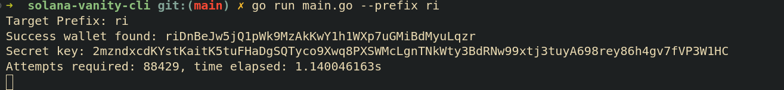

# Solana Vanity 

A simple command line tool to generate a vanity address for a given starting prefix.


## install

```bash
go build .
```

## usage
```bash
./solana-vanity --prefix ri
```

Note: Use min length of 3 characters for the prefix for bigger length this also works but it will take more time to generate the wallets.
